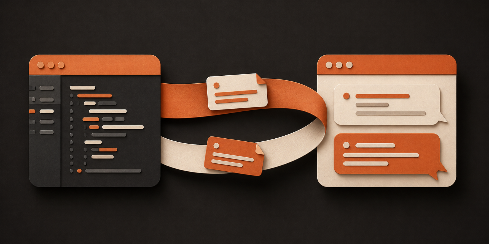

# Bachata Browser Bridge

<p align="center">
  
</p>

<p align="center">
  <a href="#connect-to-bachata"></a>
  <a href="docs/STABLE_RELEASE_GATE.md"></a>
  <a href="docs/DEVELOPMENT.md"></a>
  <a href="LICENSE"></a>
</p>

<p align="center">
  <a href="#connect-to-bachata"><strong>Connect to Bachata</strong></a> ·
  <a href="docs/PROVIDERS.md">Supported websites</a> ·
  <a href="docs/GENERIC_BROWSER_PROVIDER.md">Set up another website</a> ·
  <a href="docs/PRIVACY.md">Privacy</a> ·
  <a href="CHANGELOG.md">What’s new</a>
</p>

## Use your browser chats from Bachata

Bachata Browser Bridge is a Chrome extension that connects Bachata in Visual
Studio Code to AI chat websites such as ChatGPT and Claude, so those conversations
can take part in your pipelines—the sequences of tasks you arrange in Bachata. These are services
where you type a question and get a computer-generated answer.

When you start a browser task in Bachata, the Bridge sends its message to the chat
you connected and brings the reply back to VS Code. You do not have to copy each
message and answer between the two apps.

You need the Bachata VS Code extension and a supported chat website open and
signed in. The Bridge does not include an AI service or subscription. Other chat
websites require you to set them up explicitly; their available features vary.

The Bridge cannot read your project files or run commands on your computer.
Bachata in VS Code controls which project information is sent and which file
changes are allowed. Messages still go to the chat provider you choose. There is
no telemetry. See [Privacy](docs/PRIVACY.md) and [No telemetry](NO_TELEMETRY.md).

## What the Bridge handles

The extension:

- pairs only with the exact loopback Protocol v9 endpoint;
- binds the saved connection token to the Chrome extension origin;
- discovers explicit ChatGPT and Claude tabs;
- exposes explicitly user-bound generic browser-LLM tabs as Protocol v9 sessions;
- selects only provider conversations reported as ready;
- sends prompts and supported images to built-in providers;
- sends text-only prompts to generic providers;
- streams or captures rendered responses and visible built-in-provider assets;
- interrupts turns and provisions built-in provider tabs.

It has no filesystem or shell access. Local context, file changes, verification, and policy enforcement are owned by the VS Code extension.

## Build and test

In a development checkout with dependency lock metadata available:

```bash
npm ci
npm test
npm run test:coverage
npm run package
```

Packaging creates and verifies the exact release ZIP, including the project
license, full third-party notices, manifest entries, CRC integrity, and script
syntax smoke checks.

Maintained-source archives include the root `package-lock.json` required by `npm ci`,
but exclude dependencies, nested or alternate-package-manager locks, and generated or
runtime artifacts. Export them with:

```bash
npm run source:export -- /absolute/path/to/new/bachata-browser-bridge-source
npm run source:verify -- /absolute/path/to/new/bachata-browser-bridge-source
```

Do not zip the working directory directly.

## Connect to Bachata

1. Build or load the unpacked extension. Load the built `dist/` directory in
   `chrome://extensions` (Developer mode → Load unpacked). The `manifest.json` at the
   repository root is the maintained source of the manifest, not a loadable extension:
   it references paths that exist only after `npm run build` copies them into `dist/`.
   Loading the repository root in Chrome fails by design.
2. Copy the pairing token from Bachata’s Browser Bridge settings in VS Code, then open the browser popup.
3. Select **Paste & connect**. If you paste or type the token into the field yourself, select **Connect to VS Code** instead. The local address is filled in automatically; open **Connection settings** only if VS Code shows a different address.
4. Open a ChatGPT or Claude conversation, sign in, then select **Refresh tabs**.
5. Select **Use this chat** on a ready conversation. Each row shows its provider, title, readiness and any limitations; **Details** contains its tab ID and conversation identity.

For another AI chat website, open **Other websites** in the popup, choose **Set up current website**, then allow the displayed origin. Close the popup and use the page setup panel: auto-detect or choose controls, then validate. Composer and conversation region are required; other controls keep their stated limitations when absent. Context-menu commands remain available for advanced repair. A validated generic tab is then published to VS Code as a `generic` Protocol v9 session with explicit submission, completion, interruption, asset, and conversation-certainty capabilities. A profile without verified Send and lifecycle controls remains manual-only and is not eligible for unattended managed execution. Unbound origins are never discovered, and the extension never opens a generic tab. After restart, an existing tab on an explicitly bound origin may be re-injected and re-registered when its exact-origin permission remains granted.

The binding survives popup closes and service-worker restarts, and a Bachata-driven transition to a new conversation in the same tab keeps it. Rebinding is needed only when the binding is invalidated: the tab is closed, it navigates to an unsupported site or another origin, or its conversation is changed by hand.

The popup shows automatic/manual completion and current limitations. **Details** contains secondary capability and identity fields. Saved bindings can be removed individually; revoking site access requires confirmation and preserves profiles. Recovery shows recorded submission/Stop facts and never replays a prompt. Generic manual selection completes the existing request and may stop generation.

The popup settles into a status view. Once a conversation is bound it shows that conversation alone; **Change conversation** reveals the full list and **Done** returns. Selecting the connection status opens connection options; **Edit** reveals the token and address fields. When disconnected, the token field appears automatically and **Connection settings** reveals the address. Only ready rows offer **Use this chat**, and only while connected to VS Code. The background worker validates readiness again before binding.

## Multiple VS Code windows

The Chrome extension maintains one saved endpoint and one WebSocket. The VS Code side therefore grants Browser Bridge ownership to only one Extension Host per VS Code user profile. Other Bachata windows may continue using native adapters, but browser adapters remain unavailable until the owner closes the bridge cleanly. Uncertain shutdown is quarantined on the VS Code side rather than reassigned immediately.

## Release gate

Production background, popup, content-script, generic-provider, and Protocol v9 paths are checked before packaging. Stable support additionally requires `docs/STABLE_RELEASE_GATE.md`; current provider DOM behavior still requires the human checklist in `docs/LIVE_SMOKE_TEST.md`.

Automatic reconnect state is persisted and long retry delays use Chrome alarms so service-worker suspension does not stop recovery.

## Documentation

- [Release and deployment](docs/DEPLOYMENT.md)

- `docs/PROTOCOL.md`
- `docs/PROVIDERS.md`
- `docs/GENERIC_BROWSER_PROVIDER.md`
- `docs/SECURITY.md`
- `docs/PRIVACY.md`
- `docs/DEVELOPMENT.md`
- `docs/LIVE_SMOKE_TEST.md`
- `docs/STABLE_RELEASE_GATE.md`
